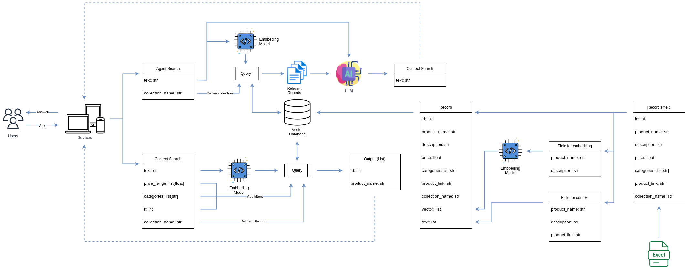

# AI Search Workflow



## Context search

- Input:

  ``` json
  {
  "text": "Example for text query",
  "collection_name": "default_collection_name",
  "price_range": [
      0,
      1000000000
  ],
  "categories": [
      "category_1",
      "category_2"
  ],
  "k": 5
  }
  ```

- Search steps:
  - Step 1: The `text` field will be embedded as a `vector`.
  - Step 2: Define __Milvus Database__ with `collection`.
  - Step 3: __Similarity search__ (cosine similarity) with `price_range` and `categories` as filters
- Output:

  ``` json
  [
    {
      "id": 123,
      "product_name": "name_of_product"
    }
  ]
  ```

## Agent Search

- Input:

  ``` json
  {
    "text": "Text query",
    "collection_name": "default_collection_name"
  }
  ```

- Search steps:
  - Step 1: The `text` field will be embedded as a `vector`.
  - Step 2: Define __Milvus Database__ with `collection`.
  - Step 3: __Similarity search__ (cosine similarity).
  - Step 4: Using __relevant records__ (output of previous step) as a __context__ and `text` as input for __LLM__ to answer question.

- Output:

  ``` json
  {
    "text": "Answered question by AI",
  }
  ```